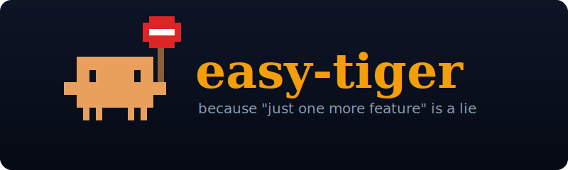

<p align="center">
  
</p>

<p align="center">
  
  
  
</p>

# easy-tiger

A Claude Code plugin that says "easy, tiger" when you're about to over-build.

You know that thing where you sit down to build a todo app, and somewhere along the way you're like *"oh, what if I also added a chat assistant to it? and a pomodoro timer? and habit tracking?"* — and three hours later you don't even have a working todo list? That.

easy-tiger is the friend sitting next to you who goes *"hey, do you actually need that right now?"* before you spend the afternoon on it. It's not a blocker. It's a vibe check.

## How it works

When you tell Claude to do something non-trivial, easy-tiger quietly checks: is this on the path to shipping, or a side quest? If it smells like creep, Claude responds in easy-tiger's voice — short, casual — and asks if you really need it. Say yes and it steps aside. Say no and it offers to park it for later.

Trivial stuff (`yes`, `thanks`, `fix typo`) gets skipped, so does anything starting with `/`, `#`, or `*`. Silence is the default.

It figures out what you're shipping from `.easy-tiger/goal.md`, then a `## Goal` section in `CLAUDE.md` or `AGENTS.md`, then your git branch + linked issue, then recent commits. If none of those exist it still catches the obvious stuff.

## Install

From the marketplace:

```
/plugin install easy-tiger
```

From GitHub:

```
/plugin marketplace add olapietka/easy-tiger
/plugin install easy-tiger@olapietka/easy-tiger
```

For local hacking:

```bash
git clone https://github.com/olapietka/easy-tiger.git
claude --plugin-dir ./easy-tiger
```

## Use

**Just build stuff.** That's the whole UX. When easy-tiger spots creep you'll see something like:

> Easy, tiger — is the chat assistant a must-have, or a wouldn't-it-be-cool? Get the todo app shipping first, you can always add more later.

**Tell it what you're shipping** (optional, makes interruptions sharper):

```
/easy-tiger:goal build a todo app with local storage
/easy-tiger:goal view
/easy-tiger:goal clear
```

**Get a real scope review** when you're feeling lost:

```
/easy-tiger:easy-tiger
/easy-tiger:easy-tiger the chat assistant feature
```

It reads your goal, your git history, and the conversation, then gives you an honest take on what to keep and what to cut.

## License

MIT
